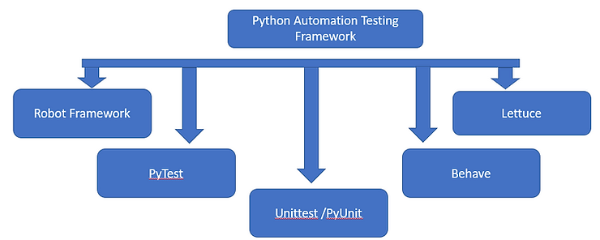
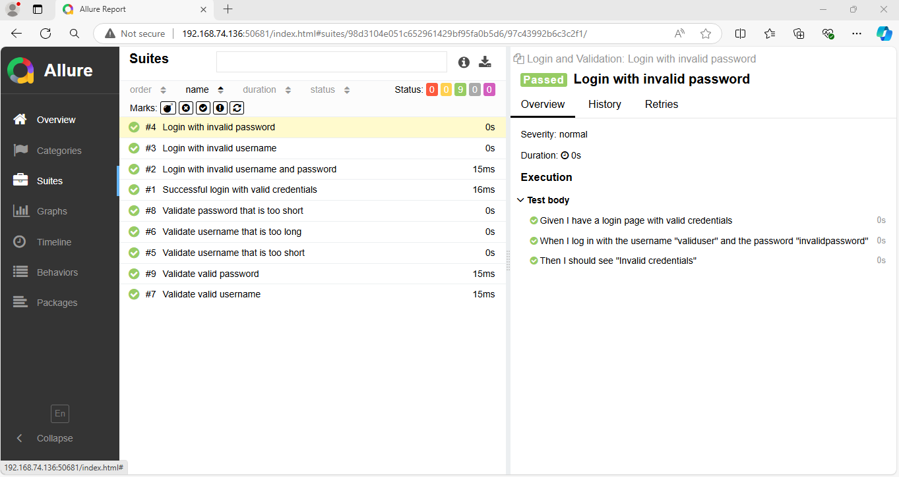

pip install allure-pytest     
python -m pytest --alluredir allure-results
allure serve allure-results

pip install behave
pip install pytest-bdd
pip install allure-behave

#make BDD directory,subdirectory features with subdirectory steps
#make .feature file and steps file

behave
behave -f allure_behave.formatter:AllureFormatter -o reports/ 
allure serve reports/
*******************************************************************************************
unittest: You define test cases directly in code, and assertions are used to verify outcomes. Reporting is enhanced with allure.
BDD: You define behavior in a natural language format (Gherkin), making it accessible to non-developers. Step definitions map the behavior to actual code.

